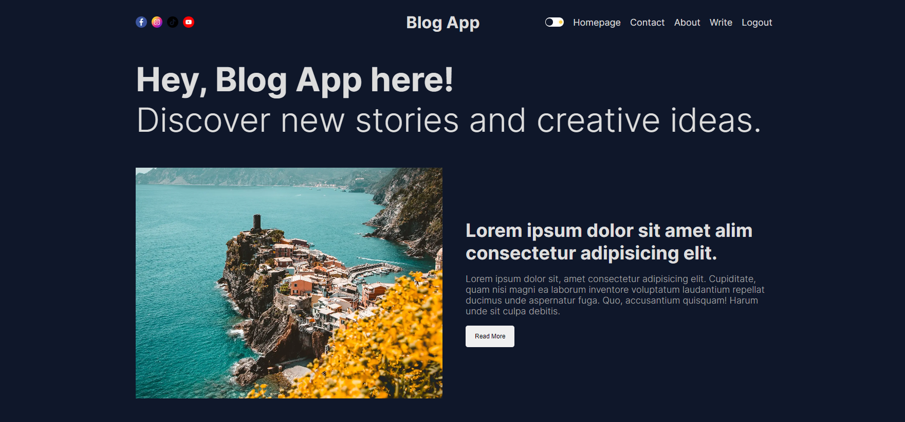
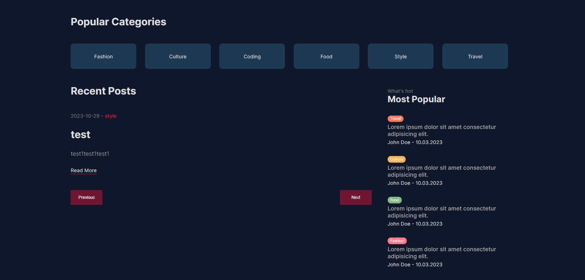
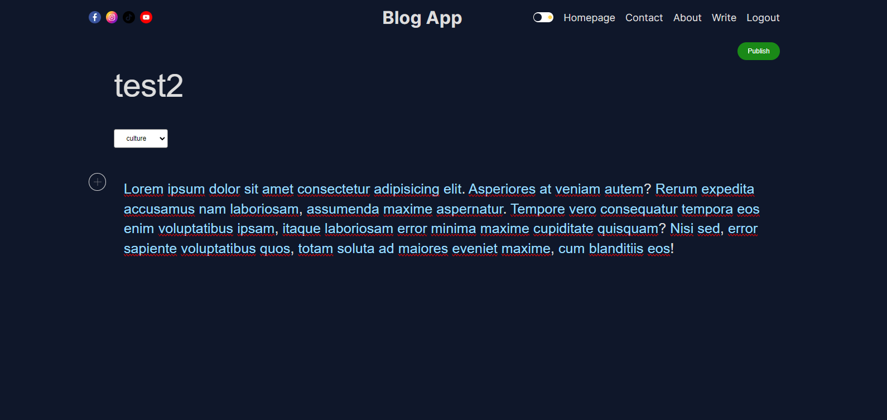

## Next.js Blog App

Fullstack Blog App created with Next.js, Prisma, NextAuth, MongoDB and Firebase.

### Screenshots





```bash
git clone https://github.com/MustafaYavas/blog-app.git
# and
npm install
# and
npm run dev
```

Open [http://localhost:3000](http://localhost:3000) with your browser to see the result.
